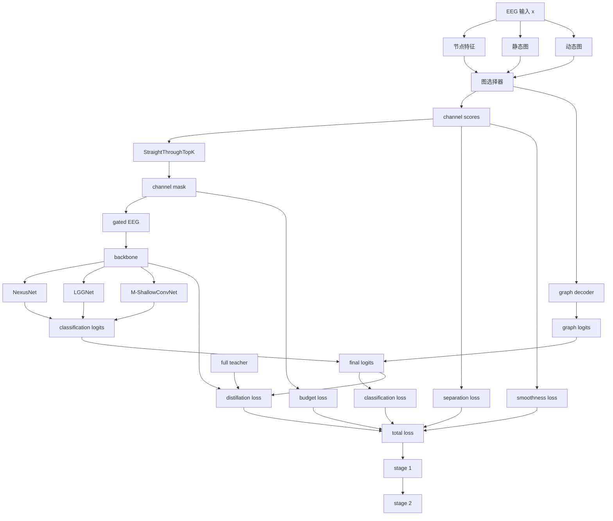

# 方法实现原理说明

## 整体算法概述

本方法整体上可以概括为一个**图引导的预算约束通道选择与分类一体化框架**。对于输入的 EEG 信号，模型首先将每个通道视为图中的一个节点，并结合通道的统计特征、时序特征以及通道之间的静态拓扑关系和动态相关关系，通过图消息传播获得每个通道的表示与评分。随后，模型利用可训练的 top-k 选择机制，在给定通道预算下生成离散的通道掩码，并将该掩码直接作用到原始 EEG 输入上，仅保留被选中的通道信息。经过预算筛选后的信号再送入下游分类 backbone 完成最终分类。为了提升少通道模型的稳定性和性能，训练阶段不仅使用分类损失，还联合引入预算约束、图平滑约束、top-k 边界分离约束以及来自全通道 teacher 模型的蒸馏损失，最后通过两阶段训练进一步微调分类器，使其在固定通道子集上达到更优性能。

如果用一句话概括，这个方法的本质就是：

**通过图结构建模、多视角通道评分、可导 top-k 预算选择和蒸馏增强训练，自动学习最优 EEG 通道子集，并在少通道约束下完成高性能分类。**

## 代码思路图

## 一、这条方向到底在做什么

这条研究路线的核心，不是单独设计一个新的 EEG 分类器，而是在现有分类 backbone 之前，加上一层**可学习的通道选择模块**，让模型在训练过程中自动决定：

- 哪些通道应该被保留
- 在给定 `top-k` 预算下如何构造最优通道子集
- 如何让少通道输入下的分类性能尽量接近甚至超过全通道模型

因此，整个方法可以理解为：

**一个“图引导的通道选择器” + 一个“下游分类 backbone” + 一套“预算约束与蒸馏训练机制”**

## 二、整体结构是怎么实现的

当前实现采用的是一个“选择器-分类器”串联结构。

输入 EEG 数据后，首先进入通道选择器。选择器会对每个通道输出一个分数，再根据预算约束形成一个通道 mask。这个 mask 会作用到原始 EEG 信号上，从而只保留被认为重要的通道信息。然后，经过选择后的信号再送入具体的分类 backbone，例如：

- `NexusNet`
- `LGGNet`
- `M-ShallowConvNet`

也就是说，分类 backbone 不负责决定“选哪些通道”，它负责的是“在已经选好的通道子集上进行分类”。  
通道选择这件事由前面的独立模块完成。

对应代码结构上，核心包装器是：

- [IoTChannelSelectionFramework.py](D:/工作目录/code/private-code/iot/paper_topk_budget_study/models/IoTChannelSelectionFramework.py)

其中最关键的两个模块是：

- `GraphGuidedChannelSelector`
- `ModelAgnosticChannelSelectionWrapper`

## 三、通道选择器的原理是什么

在算法层面，当前方法并不是单一算法，而是由几类算法组件拼接而成：

- 图神经网络式消息传播
- 可导近似的 top-k 离散选择
- 多目标联合优化
- teacher-student 蒸馏
- 两阶段训练策略

也就是说，这个方法不是依赖某一个“现成算法名词”直接解决问题，而是把多个适合 EEG 通道预算学习的算法机制组合在一起，形成一个完整系统。

### 1. 每个通道先被表示成一个节点

在实现上，EEG 每个通道都被看成图中的一个节点。  
这样做的目的是让模型不只是看单个通道强不强，而是显式建模通道之间的结构关系。

选择器会先从输入信号中提取每个通道的节点特征，这些特征既包括：

- 静态统计特征
- 时间维上的卷积特征

当前代码中，节点特征提取的入口依赖：

- `extract_node_features(...)`
- 时序卷积分支 `temporal_encoder`
- 统计特征分支 `stat_encoder`

也就是说，选择器会同时利用：

- 通道本身的统计描述
- 通道在时间序列上的局部模式

然后把这两类信息融合成统一的节点表示。

### 2. 图结构不是固定死的，而是静态图和动态图的结合

当前方法不是只使用一个固定的电极拓扑图。

它会同时考虑：

- 静态图：由电极空间关系预先定义的邻接结构
- 动态图：由当前样本中各通道特征相似性构造出来的关系

在实现中，这两部分会被混合：

- 静态图保证基本空间结构合理
- 动态图让模型能够根据当前输入样本自适应调整通道间关系

这样做的意义是：

- 静态图负责提供稳定先验
- 动态图负责补充样本相关的交互信息

因此，通道选择不是“固定电极模板下的硬筛选”，而是“带有输入自适应能力的结构化筛选”。

从算法角度看，这里结合了两类图建模思想：

- 基于先验结构的静态图建模
- 基于当前样本特征的动态图建模

然后通过图归一化和图消息传播，让节点表示在结构上下文中更新。

### 3. 通道分数不是单一路径打出来的，而是多视角融合

当前选择器不会只用一套特征直接输出通道分数，而是分别从多个视角计算通道得分，例如：

- 统计视角
- 时间模式视角
- 图传播后的结构视角

然后再把这些分数融合成最终的通道分数。

这样做的原因是，单一视角通常不稳定：

- 只看统计量，可能忽略判别性的时序模式
- 只看时序特征，可能忽略通道之间的结构关系
- 只看图传播结果，又可能过于依赖邻接结构

多视角融合的作用，就是让通道评分更稳定，也更适合下游 top-k 选择。

## 四、top-k 选择是怎么实现的

### 1. 不是简单排序截断，而是可训练的 top-k mask

模型最终的目标，是在给定预算下只保留 `k` 个通道。  
实现上，选择器先输出每个通道的连续分数，然后再通过一个近似可导的 top-k 机制把它变成 mask。

当前实现使用的是 `StraightThroughTopK`。

它的核心思想是：

- 前向传播时，执行真正的 top-k 选择，得到硬的 0/1 mask
- 反向传播时，不让梯度在硬阈值处完全中断，而是让连续分数承担梯度传播作用

这样就解决了一个关键问题：

真正的 top-k 是离散操作，直接训练很困难；  
而 straight-through 技术让模型能够在“看起来是离散选择”的同时，仍然通过梯度进行优化。

因此，从算法上说，这里采用的是一种**straight-through estimator 风格的离散选择近似算法**。  
它本质上是用连续分数承担梯度传播，用硬 top-k 保证预算选择结果。

### 2. mask 会直接作用到原始 EEG 输入上

得到通道 mask 后，不是只把它当成解释性结果保存下来，而是直接把它乘到原始 EEG 信号上：

`gated_x = x * mask.unsqueeze(-1)`

这意味着后面的 backbone 实际接收到的，就是经过预算约束后的输入。  
因此，整个系统学到的不是“理论上的重要通道”，而是“真正能让下游分类器工作得更好的通道子集”。

## 五、为什么说它是“图引导”的

“图引导”并不只是因为代码里有一个邻接矩阵，而是因为图结构真实参与了通道评分过程。

具体来说，图结构在当前方法中承担了三件事：

1. 定义通道之间的基本邻接关系  
2. 在图消息传播中更新每个通道的节点表示  
3. 通过图平滑约束影响最终选择结果

其中最关键的是消息传播层 `GraphMessageLayer`。  
它会让每个通道节点在更新自己表示时，同时吸收邻居通道的信息。这样一来，最终的通道得分就不再仅仅由单通道本身决定，而会受到周围结构上下文的影响。

这就是“图引导”的真正含义：

不是独立给通道打分，而是在图上传播信息后再决定保留哪些通道。

## 六、训练时为什么还要加约束项

如果只用分类损失训练，选择器很容易出现几个问题：

- 预算不稳定
- 分数排序不够清晰
- 选出来的通道在图结构上过于离散

所以当前实现里除了分类损失，还加入了几类辅助约束。

### 1. 预算约束

预算约束的作用是让 mask 的平均使用率接近目标预算。

例如 `top5` 对于 22 通道输入来说，目标预算就是 `5 / 22`。  
这个约束可以防止选择器在训练早期退化成“几乎全选”或“几乎不选”。

### 2. 图平滑约束

图平滑约束会鼓励相邻或相关通道的分数变化不要过于剧烈。  
这会让最终选出的通道子集在图结构上更平滑、更自然。

它本质上是通过图拉普拉斯项来约束通道得分。

### 3. 分离约束

分离约束的作用是拉开第 `k` 个通道和第 `k+1` 个通道之间的得分差距。

这很重要，因为如果 top-k 边界附近的通道分数非常接近，那么最终选择就会非常不稳定。  
加入分离约束后，模型会更倾向于形成清晰的前 k 名和后续通道之间的间隔。

从优化角度看，这里实际采用的是一个**多目标联合损失函数**。  
总损失并不只有分类交叉熵，而是由以下几部分共同构成：

- 分类损失
- 预算约束损失
- 图平滑损失
- top-k 分离损失
- 蒸馏损失

这种设计的本质，是把“分类正确”和“选择合理”同时纳入优化目标。

## 七、为什么还要做蒸馏

少通道模型最大的困难之一，不仅是输入信息减少，还在于优化更难。

所以当前实现中，不是直接让少通道模型从零硬学，而是先训练对应的全通道 baseline，然后把它当作 teacher，把知识迁移给带选择器的 student。

蒸馏主要体现在两个层面：

- 输出层蒸馏：让 student 的预测分布接近 teacher
- 特征层蒸馏：让 student 的中间表示尽量接近 teacher

这样做的作用是：

- 让少通道模型更容易收敛
- 避免 top-k 选择器刚开始学习时把 backbone 一起带偏
- 提高少通道模型逼近全通道性能的可能性

因此，这里使用的算法思想是**知识蒸馏（Knowledge Distillation）**，并且同时包含：

- logit-level distillation
- feature-level distillation

## 八、为什么训练分成两个阶段

当前实现不是整个训练过程都让选择器和 backbone 同时自由更新到底，而是分成两个阶段。

### 第一阶段

第一阶段中：

- 选择器参与学习
- 通道 mask 逐渐从软选择过渡到硬选择
- 分类器和选择器一起适应预算约束

这一阶段的目标，是先学出比较合理的通道筛选模式。

### 第二阶段

第二阶段中：

- 冻结选择器参数
- 固定已经学到的通道子集
- 只微调 backbone

这样做的原因是，第一阶段结束后，通道子集已经大致确定；此时继续让选择器频繁变化，反而会干扰分类器稳定收敛。  
冻结选择器后，backbone 可以专注于在固定少通道输入上进一步提升性能。

## 九、为什么这个方法可以挂在不同 backbone 上

这是当前实现里很重要的一点。

通道选择器本身不依赖某一个具体分类器的内部结构。  
它只做两件事：

1. 生成通道 mask
2. 将经过 mask 的输入送给下游 backbone

只要一个 backbone 能接受标准 EEG 输入并输出分类结果，它就可以被这个框架包装起来。

因此，这套方法的重点不是重新发明每一个分类器，而是在分类器前面增加一个统一的、可学习的、预算受控的选择层。

这就是为什么它能够同时配合：

- `NexusNet`
- `LGGNet`
- `M-ShallowConvNet`

## 十、当前这条方向的本质

从本质上说，这条方向做的事情可以总结为：

**在 EEG 分类任务中，把“选通道”这件事从手工经验规则，变成一个可训练、可约束、可迁移的结构化学习模块。**

它的原理不是“先排序再裁掉一些通道”，而是：

- 用图结构描述通道关系
- 用多视角特征学习通道重要性
- 用可导 top-k 机制执行预算选择
- 用预算约束、图平滑和分离约束稳定选择边界
- 用全通道蒸馏帮助少通道模型学习
- 用两阶段训练提高最终分类性能

因此，这个方向的核心不是某一个单独技巧，而是一个完整的实现闭环：

**图引导建模 -> 通道评分 -> top-k 选择 -> 预算约束训练 -> 蒸馏迁移 -> 固定子集微调**

## 十一、这条方法具体用了哪些算法

如果从“算法组成”角度概括，当前方法主要用了以下几类算法：

### 1. 图消息传播算法

用于建模 EEG 通道之间的结构关系。  
实现上不是标准论文里某个完整照搬的 GCN/GAT 模块，而是一个更轻量的图消息传播层，用来在邻接结构上更新通道节点表示。

### 2. 动态图构造算法

除了静态电极图之外，方法还会根据当前输入样本构造动态图，以反映不同样本下通道相关性的变化。

### 3. Straight-Through Top-k 近似算法

用于在训练中实现“前向是硬 top-k、反向仍可传梯度”的离散选择机制。

### 4. 多目标联合优化算法

训练目标不是单一交叉熵，而是一个联合目标，综合考虑分类性能、预算控制、图平滑和边界分离。

### 5. 知识蒸馏算法

利用全通道 teacher 指导少通道 student，使 budget 模型更容易逼近 full baseline。

### 6. 两阶段优化策略

先联合学习选择器和分类器，再冻结选择器微调分类器，提高最终少通道模型稳定性。

## 十二、当前方法的创新点在哪里

当前方法的创新不在于单独发明了某一个全新的基础算法，而在于把多个算法机制围绕“EEG 通道预算学习”这个问题进行了系统整合，并形成了一个完整闭环。

可以把创新点概括为以下几条。

### 1. 把通道选择从静态排序变成结构化选择

传统方法更像是在做通道重要性分析，而当前方法真正优化的是“在固定预算下选出一个最优通道子集”。  
也就是说，研究对象从单通道分数，提升为通道组合本身。

### 2. 将静态图与动态图共同引入通道选择

这不是只用预定义电极拓扑做一个图约束，也不是只做样本相关图，而是将：

- 稳定的空间先验
- 输入驱动的动态关系

联合起来引导通道评分与选择。  
这一点使得选择过程同时具备结构性和自适应性。

### 3. 在 backbone 之前插入一个可迁移的选择层

当前方法不是把通道选择绑死在某一个分类器内部，而是设计成一个可包装不同 backbone 的前置模块。  
因此，它的贡献不是特定分类器的小修小补，而是一个具有跨模型适用性的选择框架。

### 4. 在显式 top-k 预算下联合优化选择与分类

很多工作会先做通道分析，再把结果拿给分类器使用；而当前方法是在训练阶段直接联合优化：

- 选哪些通道
- 如何利用选中的通道完成分类

这让预算约束真正进入了模型学习过程，而不是训练后附加的筛选步骤。

### 5. 将图约束、预算约束、分离约束和蒸馏整合为统一训练框架

当前方法的另一个关键创新，是不是只使用一种正则，而是把多种机制统一到一个训练目标中。  
这使选择结果既要满足：

- 有利于分类
- 符合预算
- 在图结构上更平滑
- 在 top-k 边界上更稳定
- 能够继承全通道模型知识

这种统一的训练框架，比单一约束或单一排序机制更完整。

### 6. 用“先主预算、再迁移”的方式组织调参与实验

当前实验设计里，先稳定 `top5`，再迁移到 `top3/8`，并不是纯粹的工程折中，而是一种围绕预算研究问题组织实验的方式。  
它强化了“主预算点驱动、邻近预算扩展”的研究逻辑，也让实验结果更连贯。

## 十三、一句话总结

这条方法路线的实现原理，就是在 EEG 分类 backbone 前加入一个图引导的可学习通道选择器，让模型在训练过程中自动学习“在给定 top-k 预算下保留哪些通道最有利于最终分类”，并通过结构约束、蒸馏机制和分阶段训练，使少通道模型获得尽可能强的性能表现。
